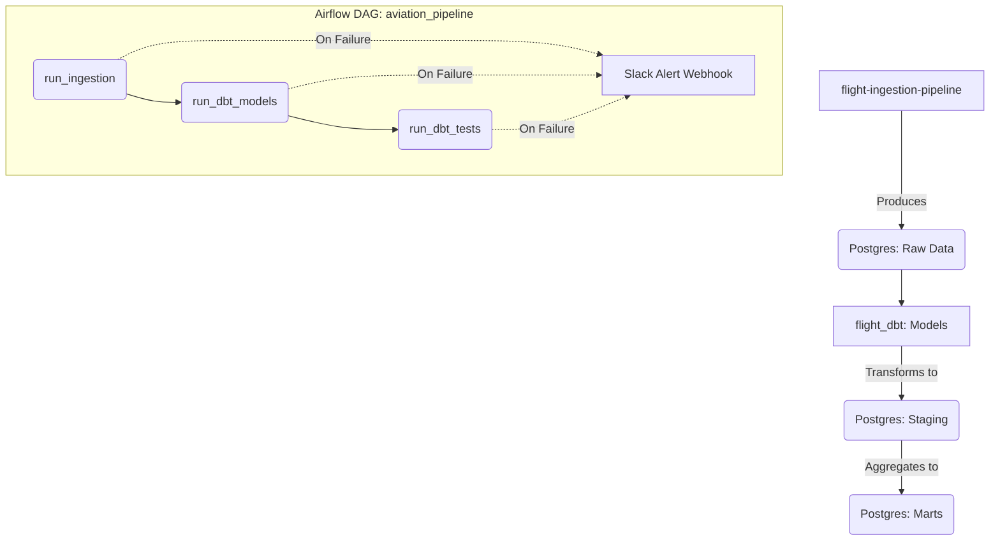

# Aviation Data Pipeline - Orchestration (B1)

This project orchestrates the data ingestion and dbt transformations for the aviation data pipeline using Apache Airflow.

## Architecture Diagram



## Features Implemented
- **Scheduled Ingestion**: `run_ingestion` task invokes the D1 ingestion script.
- **dbt Transformation & Testing**: `run_dbt_models` and `run_dbt_tests` trigger the C1 dbt project.
- **Task Retries & Backoff**: Configured with exponential backoff on task failures (up to 3 retries).
- **Failure Alerting**: A custom failure callback triggers a webhook (Slack/Discord) alert if any task fails.
- **SLA & Backfill**: Built-in SLA callback checks (`sla=30m`) and `catchup=True` to backfill historical missing runs.

## Prerequisites
- Python 3.10+
- The ingestion pipeline at `../flight-ingestion-pipeline`
- The dbt project at `../flight_dbt`

## How to Run Locally

1. **Activate Environment & Install Airflow**
   ```bash
   python3 -m venv .venv
   source .venv/bin/activate
   pip install apache-airflow
   ```

2. **Initialize Airflow Database**
   ```bash
   export AIRFLOW_HOME=$(pwd)
   airflow db migrate
   ```

3. **Create an Airflow User**
   ```bash
   airflow users create \
       --username admin \
       --firstname Admin \
       --lastname User \
       --role Admin \
       --email admin@example.com \
       --password admin
   ```

4. **Configure the Slack Webhook**
   Add your webhook URL as an Airflow variable to enable alerting:
   ```bash
   airflow variables set SLACK_WEBHOOK_URL "https://hooks.slack.com/services/T000/B000/XXX"
   ```

5. **Start Airflow Services**
   Open two terminals:
   - Terminal 1 (Webserver): `airflow webserver -p 8080`
   - Terminal 2 (Scheduler): `airflow scheduler`

6. **Trigger the DAG**
   Navigate to `http://localhost:8080`, log in, unpause the `aviation_pipeline` DAG, and trigger it.
